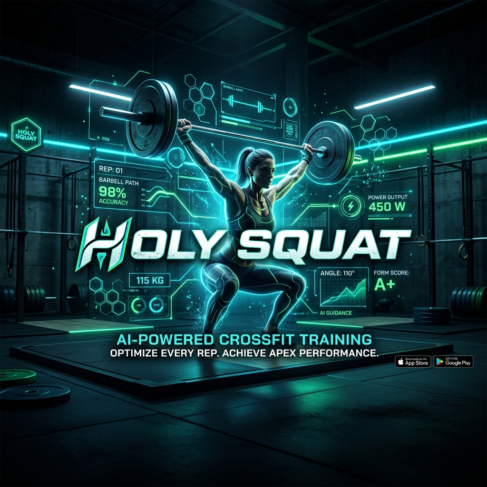
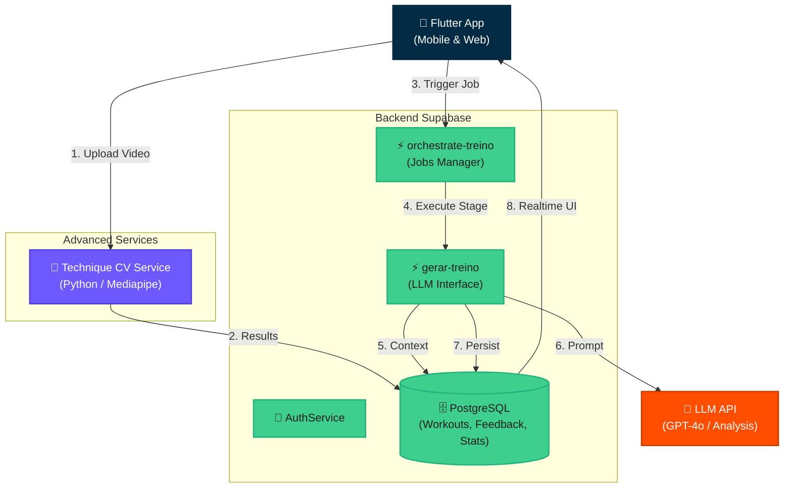
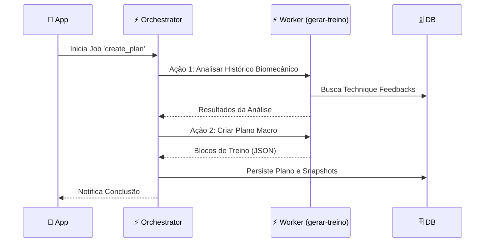
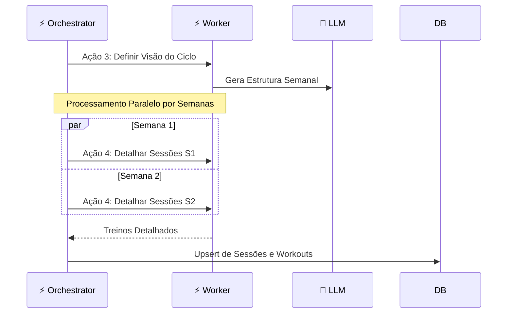

<h1 align="center">
  <br>
  🏋️ Holy Squat App
  <br>
</h1>

<h4 align="center">Plataforma Inteligente de Treinamento com Múltiplos Coaches de IA, Periodização de Mesociclos e Análise Biomecânica.</h4>

<p align="center">
  <a href="#about-the-app">Sobre</a> •
  <a href="#key-features">Funcionalidades</a> •
  <a href="#system-architecture">Arquitetura</a> •
  <a href="#ai-orchestration">Orquestração</a> •
  <a href="#technologies">Tecnologias</a> •
  <a href="#how-to-run">Como Executar</a>
</p>



---

## 🚀 Sobre o App

**Holy Squat** é um ecossistema avançado de treinamento projetado para atletas de CrossFit e Cross Training. Diferente de apps genéricos, ele utiliza **IA Orquestrada** para gerar periodizações contínuas (mesociclos), adaptando volume, intensidade e técnica de acordo com a evolução real do atleta.

Com uma arquitetura _serverless_ robusta baseada em **Supabase**, o app integra análise biomecânica via visão computacional para garantir que cada repetição seja executada com segurança e eficiência.

## ✨ Funcionalidades Principais

- **🤖 Planejamento Multi-Coach (AI Orchestrated):** Diferentes treinadores de IA focados em Weightlifting, Gymnastics ou Endurance. A geração é dividida em estágios de Planejamento Macro e Detalhamento Micro.
- **🧬 Análise Biomecânica (Technique Feedback):** Motor de visão computacional que analisa vídeos de exercícios para identificar falhas técnicas e injetar correções diretamente no próximo ciclo de treino.
- **📅 Periodização Inteligente:** Geração automática de blocos de 4 a 8 semanas com progressão de carga e semanas de _deload_.
- **📊 Métricas Avançadas & Snapshots:** Acompanhamento via Radar Charts (Aderência por tipo), Índice de Potência, PSE Médio e snapshots históricos de performance para comparação entre ciclos.
- **⚡ Orquestração Assíncrona:** Sistema de Jobs que processa gerações complexas em background, garantindo uma interface fluida.
- **🎨 UI Premium:** Design moderno em Flutter com suporte a Dark/Light mode e visualização intuitiva de sessões.

---

## 🏗 Arquitetura do Sistema

O Holy Squat utiliza uma abordagem de microserviços e funções isoladas para garantir escalabilidade e performance.



---

## 🔄 Fluxo de Orquestração de IA

A geração de treinos não é linear. Ela segue um ciclo de vida orquestrado que garante coerência a longo prazo.

### 1. Estágio de Planejamento (GO!)
Nesta fase, o sistema cria o "esqueleto" do mesociclo baseado no histórico total do atleta.



### 2. Estágio de Ciclo (Next Cycle)
Geração detalhada das sessões diárias, executando o detalhamento das semanas em paralelo para máxima velocidade.



---

## 📈 Métricas e Snapshots de Performance

O app agora captura o estado do atleta em momentos específicos do ciclo, permitindo uma análise comparativa profunda:

- **Adherence Radar:** Visualização clara de quais capacidades físicas (LPO, Ginástica, Cardio) estão sendo mais executadas.
- **Power Index:** Cálculo dinâmico de performance baseado em carga relativa e RM.
- **Cycle Snapshot:** No início de cada novo ciclo, o sistema congela os KPIs atuais (Peso, RMs, Volume total) para medir o impacto real da periodização ao final do período.

---

## 🛠 Tecnologias

- **Frontend:** Flutter (Dart)
- **Backend:** Supabase (PostgreSQL, Edge Functions, Storage)
- **AI/LLM:** OpenAI GPT-4o / LangChain patterns
- **Computer Vision:** Mediapipe, Python (Technique Analysis)
- **Infrastructure:** Deno (Edge Functions), Docker (CV Service)

---

## ⚙️ Como Executar Localmente

### Pré-requisitos
- [Flutter SDK](https://docs.flutter.dev/get-started/install) (`>= 3.0.0`)
- [Supabase CLI](https://supabase.com/docs/guides/cli)
- Docker (opcional, para rodar o serviço de análise de técnica localmente)

### 1. Instalação
```bash
git clone https://github.com/your-username/holy_squat_app.git
cd holy_squat_app
flutter pub get
```

### 2. Configuração das Edge Functions
Certifique-se de configurar as chaves da OpenAI e Supabase no seu ambiente local (ou via Supabase Secrets).

```bash
supabase functions serve --no-verify-jwt
```

### 3. Rodando o App
```bash
flutter run
```

---

## 🔒 Segurança

Toda a lógica sensível (integração com LLM e processamento de vídeos) é executada em ambiente seguro de **Edge Functions** ou containers isolados, garantindo que chaves de API nunca fiquem expostas no código do cliente.
