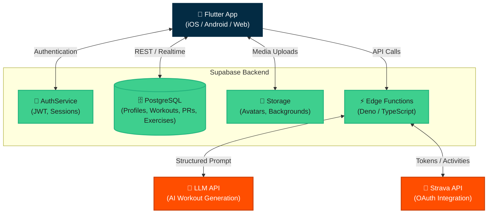
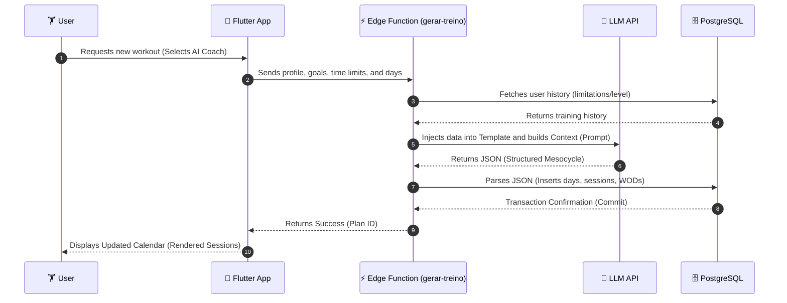

<h1 align="center">
  <br>
  🏋️ Holy Squat App
  <br>
</h1>

<h4 align="center">Your Smart Training Platform featuring Multiple AI Coaches, Mesocycle Periodization, and Strava Integration. Designed to transform your CrossFit performance.</h4>

<p align="center">
  <a href="#about-the-app">About</a> •
  <a href="#key-features">Features</a> •
  <a href="#technologies">Technologies</a> •
  <a href="#how-to-run">How To Run</a> •
  <a href="#security-and-data">Security</a>
</p>

<!-- 
    > [Note for Samuel: You can add a "cover" image and app screenshots here. I used a placeholder below, just replace the link later!]
-->


---

## 🚀 About the App

**Holy Squat** is not just another workout app; it is an advanced periodization planner specifically designed for CrossFit and Functional Fitness athletes. Leveraging Artificial Intelligence to generate continuous and scalable plans (mesocycles), the app offers users the experience of training with their preferred "Virtual Coaches," adapting volume, intensity, and skills to individual goals.

With a fully serverless ecosystem powered by **Supabase**, Holy Squat delivers a premium experience focused on constant evolution, stability, and in-depth analysis.

## ✨ Key Features

- **🤖 Multi-Coach AI Planning:** Different AI trainers focused on your biggest needs (e.g., Weightlifting, Gymnastics, Endurance). Workouts are calculated to perfectly fit your available time and desired intensity.
- **📅 Advanced Periodization (Mesocycles):** Smart and organized generation in adaptive weekly training blocks.
- **🔥 Complete WOD Structure:** Automated and flawless breakdown into _Warmup_, _Skill_, _Strength_, _Workout_ (WOD), and _Cooldown_.
- **📊 Native Integration:** OAuth connection and direct webhook with **Strava** for importing activity logs and health biometrics (in development).
- **📈 Analytics and PR Tracking:** Immersive charts for load progression (Personal Records), Benchmarks for famous "Girls/Heroes", and detailed visual tracking of cardio and strength progress.
- **🎨 Premium UI & Aesthetics:** Clean and modern Flutter design with robust support for _Dark Mode_ and _Light Mode_.
- **📥 Rich Database:** Comprehensive library of cataloged exercises with metadata integrated over time.

## 🛠 Technologies

A modern, highly responsive, and fully scalable stack:

- **Frontend / Mobile / Web:** [Flutter](https://flutter.dev/) (Dart) 
  - Strong state management, reactive navigation, and smart form handling.
  - Core Libraries: `fl_chart`, `table_calendar`, `youtube_player_iframe`, `share_plus`.
- **Backend & Authentication:** [Supabase](https://supabase.com/) 
  - **Database:** PostgreSQL handling large volumes of _logs_ and relational tables.
  - **Auth:** Secure session management, user profiles, and JWT.
  - **Storage:** Optimized hosting for avatars, background files, and PDFs.
  - **Edge Functions:** Heavy serverless logic using TypeScript (Deno) for interfacing with LLM APIs (AI generation) and Authentication (OAuth).
- **Data & Ingestion (ETL):** Isolated Python scripts for cleaning and standardizing massive legacy workout datasets via CSV/PDF for direct database ingestion.

---

## 🏗 System Architecture

Below is the macro diagram representing the elegant separation between the Frontend, Supabase serverless ecosystem, and critical external integrations.



## 🔄 Workout Generation Flow (AI)

The diagram below illustrates step-by-step how the application choreographs data between the client app and the Edge Functions to result in the perfect long-term athlete periodization.



---

## ⚙️ How To Run Locally

### Prerequisites
- [Flutter SDK](https://docs.flutter.dev/get-started/install) (`>= 3.0.0`)
- [Supabase CLI](https://supabase.com/docs/guides/cli) (for running local database or migrations)
- Android/iOS Emulator configured or a compatible web browser.

### 1. Cloning and Installing Dependencies
```bash
git clone https://github.com/your-username/holy_squat_app.git
cd holy_squat_app
flutter pub get
```

### 2. Configuring Environment Variables
Create a `.env` file in the project's root containing your database connection keys. *(Note: Supabase Cloud / Local configurations should be appended here; this file is ignored in Git for your safety).*

```env
SUPABASE_URL=your_supabase_url
SUPABASE_ANON_KEY=your_anon_key
```

### 3. Running the Application
```bash
flutter run
```

---

## 🔒 Security and Data Handling

We continuously review good security practices:
- **API Keys and Tokens:** All active keys and secrets (Supabase Keys and Strava integrations) are isolated and uniquely referenced via local environment (`.env`), without any exposure in version controllers thanks to `.gitignore`.
- **Isolated Backend:** Any manipulation of heavy secrets (such as LLM integrations for the AI Coach and the Strava API) now fully reside in secure **Edge Functions** within Supabase, keeping third-party keys completely away from the frontend application logic.

> **Important:** Legacy local files and migrated infrastructure (e.g., Vercel) have been successfully deprecated from this repository without leaving sensitive environment traces.

---
